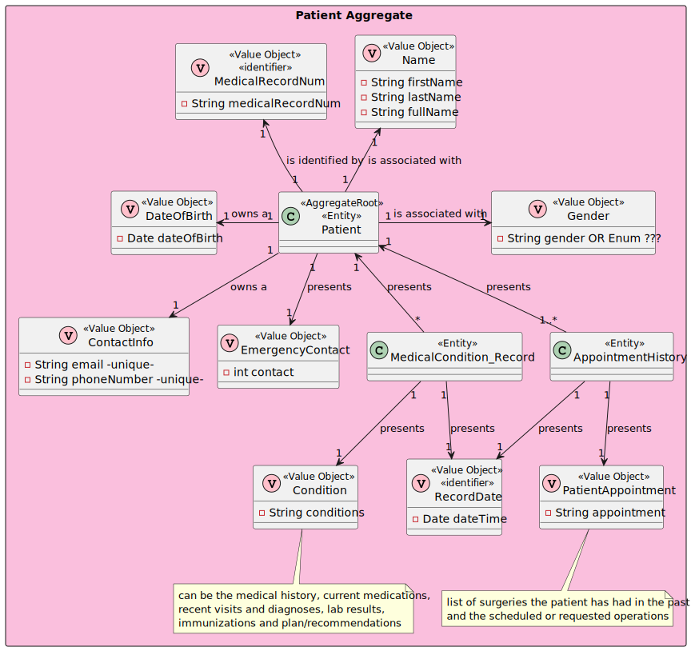

# US 5.1.09

## 1. Context

The context of this US is to update patient profiles.

## 2. Requirements

### 2.1. User Story Description

- **US 5.1.09** As an Admin, I want to edit an existing patient profile, so that I can update their information when needed.

### 2.2. Customer Specifications and Clarifications

> Question 1 - ID
>
> Q: Numa das perguntas realizadas anteriormente, o cliente respondeu que o Admin, aquando da us 5.1.8, apenas pode inserir o first name, last name, date of birth e o contact information. 
> No entanto, no caderno de encargos, nos critérios de aceitação da us 5.1.9 está escrito o seguinte: "Editable fields include name, contact information, medical history, and allergies.". Sendo assim, este critério de aceitação não deveria ser apenas os parâmetros que ele próprio inseriu?
> 
> A: sim. devem considerar como critério de aceitação: Editable fields are first name, last name, date of birth and contact information
> 
> https://moodle.isep.ipp.pt/mod/forum/discuss.php?d=31979

### 2.3 Acceptance Criteria

1. Admins can search for and select a patient profile to edit.
2. Editable fields include name, contact information and birth.
3. Changes to sensitive data (e.g., contact information) trigger an email notification to the patient.
4. The system logs all profile changes for auditing purposes.

### 2.5. Dependencies/References

* US08 - Create Patient Profile

### 2.6. Input and Output Data

***Input Data:***
* Typed data:
  * Full Name
  * Email
  * Phone Number
  * Date of Birth
  * Emergency Contact

- The admin only fills in the fields he wants to change!

* Selected data:
  * Patient id - medicalRecordNumber

***Output Data:***
* Success or failure of the operation

## 3. Analysis

### 3.1. Domain Model excerpt (DM)

## 4. Design

### 4.1. Realization

#### 4.1.1 Process view

##### 4.1.1.1 Level 1

##### 4.1.1.2  Level 2

##### 4.1.1.3  Level 3

#### 4.1.2 Logical view

##### 4.1.2.1 Level 1

##### 4.1.2.2  Level 2

##### 4.1.2.3  Level 3

#### 4.1.3 Cenário view

##### 4.1.3.1 Level 1

### 4.2. Applied standards

The applied standards are:

- REST + ONION (architectural patterns);
- DTO;
- Persistence;
- Controller;
- Service;
- Interfaces;
- Scheme;
- Mapper;
- Repository;
- ORM.

### 4.3. Tests

**Domain Tests:**

Domain tests are found in the class: Domain.Tests\PatientTest.cs

**E2E Tests:** *Verifies that *

E2E tests were performed in Postman.

**Integration Tests with isolation:** *Verifies that *

Integration tests are found in the class: WebApi.IntegrationTests\Tests\Patient

## 5. Integration/Demonstration

## 6. Observations

N/A