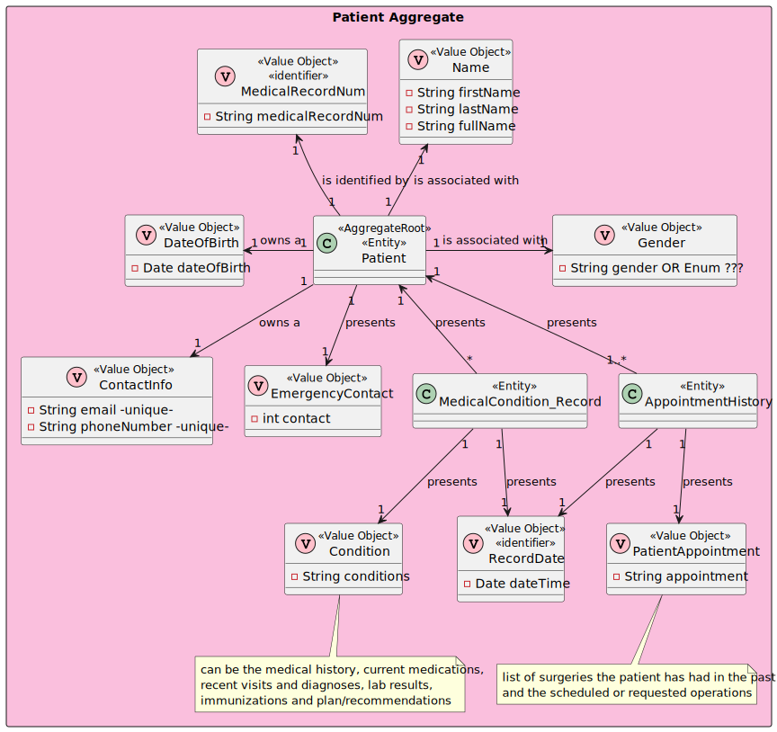

# US 5.1.10

## 1. Context

The context of this US is to delete patient profiles.

## 2. Requirements

### 2.1. User Story Description

- **US 5.1.10** As an Admin, I want to delete a patient profile, so that I can remove patients who are no longer under car

### 2.2. Customer Specifications and Clarifications

> Question 1 - ID
>
> Q: What happens to patient data after the profile is deleted?
> 
> A: Patient data must be retained for a legally mandated period before being anonymized or deleted.
> 
> https://moodle.isep.ipp.pt/mod/forum/discuss.php?d=31336

> Question 1 - ID
>
> Q: When one of the contents that administrator edits is a sensitive content (eg. email), the notification is sent for what patient's email, the email in patient account, the old email of patient or the new email of patient?
>
> A:  if the email is changed, the notification should be sent to the "old" email
>
> https://moodle.isep.ipp.pt/mod/forum/discuss.php?d=31685

### 2.3 Acceptance Criteria

1. Admins can search for a patient profile and mark it for deletion.
2. Before deletion, the system prompts the admin to confirm the action.
3. Once deleted, all patient data is permanently removed from the system within a predefined time frame.
4. The system logs the deletion for audit and GDPR compliance purposes.

### 2.5. Dependencies/References

* US08 - Create Patient Profile

### 2.6. Input and Output Data

***Input Data:***
* Typed data:
  * Id (Medical Record Number) of Patient want to delete

***Output Data:***
* Success or failure of the operation

## 3. Analysis

### 3.1. Domain Model excerpt (DM)

## 4. Design

### 4.1. Realization

#### 4.1.1 Process view

##### 4.1.1.1 Level 1

##### 4.1.1.2  Level 2

##### 4.1.1.3  Level 3

#### 4.1.2 Logical view

##### 4.1.2.1 Level 1

##### 4.1.2.2  Level 2

##### 4.1.2.3  Level 3

#### 4.1.3 Cenário view

##### 4.1.3.1 Level 1

### 4.2. Applied standards

The applied standards are:

- REST + ONION (architectural patterns);
- DTO;
- Persistence;
- Controller;
- Service;
- Interfaces;
- Scheme;
- Mapper;
- Repository;
- ORM.

### 4.3. Tests

**Domain Tests:**

Domain tests are found in the class: Domain.Tests\PatientTest.cs

**E2E Tests:** *Verifies that *

E2E tests were performed in Postman.

**Integration Tests with isolation:** *Verifies that *

Integration tests are found in the class: WebApi.IntegrationTests\Tests\Patient

## 5. Integration/Demonstration

## 6. Observations

N/A