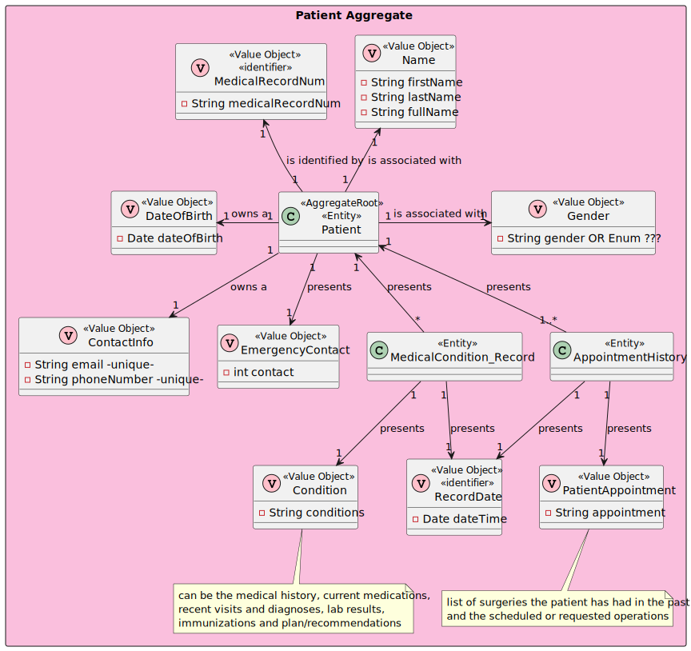

# US 5.1.11

## 1. Context

The context of this US is to list patients profiles.

## 2. Requirements

### 2.1. User Story Description

- **US 5.1.11** As an Admin, I want to list/search patient profiles by different attributes, so that I can view the details, edit, and remove patient profiles.

### 2.2. Customer Specifications and Clarifications

> Question 1 - ID
>
> Q: As discussed in a class, there are plenty of filters for the doctors profiles, however im struggling to see what filters can be applied to the patients profiles listing. 
> They can be searched by name, email, date of birth, or medical record number, but everyone has the same role, no specialization, and so on. 
> Can you be a bit more detailed on the filters you're looking to be applied in the patients listings?
> 
> A: users should be able to search students by: name, AND/OR email, AND/OR phone number, AND/OR medical record number, AND/OR date of birth, AND/OR gender
> 
> https://moodle.isep.ipp.pt/mod/forum/discuss.php?d=31519

### 2.3 Acceptance Criteria

1. Admins can search patient profiles by various attributes, including name, email, date of birth, or medical record number.
2. The system displays search results in a list view with key patient information (name, email, date of birth).
3. Admins can select a profile from the list to view, edit, or delete the patient record.
4. The search results are paginated, and filters are available to refine the search results.

### 2.5. Dependencies/References

* US08 - Create Patients Profile

### 2.6. Input and Output Data

***Input Data:***
* Typed data:
  * The attribute we want to search for

***Output Data:***
* Patient list

## 3. Analysis

### 3.1. Domain Model excerpt (DM)

## 4. Design

### 4.1. Realization

#### 4.1.1 Process view

##### 4.1.1.1 Level 1

##### 4.1.1.2  Level 2

##### 4.1.1.3  Level 3

#### 4.1.2 Logical view

##### 4.1.2.1 Level 1

##### 4.1.2.2  Level 2

##### 4.1.2.3  Level 3

#### 4.1.3 Cenário view

##### 4.1.3.1 Level 1

### 4.2. Applied standards

The applied standards are:

- REST + ONION (architectural patterns);
- DTO;
- Persistence;
- Controller;
- Service;
- Interfaces;
- Scheme;
- Mapper;
- Repository;
- ORM.

### 4.3. Tests

**Domain Tests:**

Domain tests are found in the class: Domain.Tests\PatientTest.cs

**E2E Tests:** *Verifies that *

E2E tests were performed in Postman.

**Integration Tests with isolation:** *Verifies that *

Integration tests are found in the class: WebApi.IntegrationTests\Tests\Patient

## 5. Integration/Demonstration

## 6. Observations

N/A