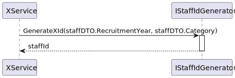

# US 5.1.12

## 1. Context

The context of this US is to create staff profiles, which represents the professionals providing healthcare (doctors and nurses), and add that profiles to the hospital’s roster.

## 2. Requirements

### 2.1. User Story Description

- **US 5.1.12** As an Admin, I want to create a new staff profile, so that I can add them to the hospital’s roster.

### 2.2. Customer Specifications and Clarifications

> Question 1 - ID
>
> Q: Are healthcare staff IDs unique across roles?
>
> A: Yes, staff IDs are unique and not role-specific (e.g., a doctor and nurse can share the same ID format).

> Question 2 – ID and License Number
>
> Q: I have one question related to the staff license number.
Since it will be generated, would you like it to be generated in any particular format or algorithm of your choice?
>
> A: There is a misinformation in the RFP.
> **Staff id** are *unique* and *generated by the system.*
> **License numbers** are *unique* but are *not generated by the system*.
>
>  > License numbers are assigned by the professional guild. The admin will enter the license number and the system records it.
>
>  >Staff id follow the format "(N | D | O)yyyynnnnn" for instance, N202401234
> >
>  >N is for nurse, D is for doctor, O is for other.
> >
>  >yyyy is the year of recruitment
> >
>  >nnnnn is a sequential number

> Question 3 - Specialization
>
> Q: Médicos e enfermeiros podem ter apenas uma especialidade ou podem ser especialistas em várias?
Quem faz parte do staff? Toda a gente na sala de operação? Se sim, todos eles tem as suas respetivas especialidades, incluindo técnicos?
>
> A: Um médico ou enfermeiro apenas tem uma especialização. No staff apenas consideramos médicos e enfermeiros.

> Question 4 - Mechanographic number, Staff id and License number
>
> Q: Can you clarify the difference between mechanographic number, staff id and license number?
>
> A: The staff id and mechanographic number is the same concept. The license number is the number assigned by the professional guild (ex., "ordem dos enfermeiros", "ordem dos médicos") to the doctor or nurse attesting they legally can perform the medical acts of their profession.

> Question 5 - Account role vs Staff role
>
> Q: As it you mentioned before " A unique staff ID is generated upon profile creation" and "Staff id follow the format "(N | D | O)yyyynnnnn" for instance, N202401234. N is for nurse, D is for doctor, O is for other. yyyy is the year of recruitment and nnnnn is a sequential number."
>
>My question is how are we suposed to generate an ID that needs the role to be correctly generated upon profile creation if there is no infomation about the role of the staff upon profile creation and firstly the profile is created and only then can be linked to an account wich actually contains information about the role.
>
> A: Going a little bit too technical, it seems you are mixing the "account" and "role" concepts within the "autentication and authorization" subdomain, and the "collaborator/staff" and "role" concepts within the "collaborator/staff subdomain.
> When the admin creates an account they assign it a role for role-based permissions, e.g., someone with role A can access function F1 but not F2
> When the admin creates a staff profile they assign it a role/category to describe the capabilities and responsibilities of that person within the system, e.g., someone with role/category "Doctor" has a specialization "X" and requests an operation of type "O" for a patient "P"

> Question 6 - list of specializations
>
> Q: Will there be a list of specializations in the system?
>
> A: Yes, a predefined list of specializations will be provided, but the system should allow for future additions.

> Question 7 - shared specializations
>
> Q: Regarding the specializations, do doctors, nurses, and technicians share the same group of specializations, or does each type of professional have distinct, role-specific specializations? Could you clarify how these specializations are categorized?
>
> A: They share the same set of specializations.

### 2.3 Acceptance Criteria

1. Admins can input staff details such as first name, last name, contact information, and specialization.
2. A unique staff ID (License Number) is generated upon profile creation.
3. The system ensures that the staff’s email and phone number are unique.
4. The profile is stored securely, and access is based on role-based permissions.

### 2.5. Dependencies/References

* N/A

### 2.6. Input and Output Data

***Input Data:***
* Typed data:
    * Full name
    * License number
    * Email
    * Phone number
    * Recruitment year
*Selected data:
    * Role/Category (doctor, nurse or other)
    * Specialization

***Output Data:***
* Staff created or insuccess 

## 3. Analysis

### 3.1. Domain Model excerpt (DM)

## 4. Design

### 4.1. Realization

#### 4.1.1 Process view

##### 4.1.1.1 Level 1

##### 4.1.1.2  Level 2

##### 4.1.1.3  Level 3

#### 4.1.2 Logical view

##### 4.1.2.1 Level 1

##### 4.1.2.2  Level 2

##### 4.1.2.3  Level 3

#### 4.1.3 Cenário view

##### 4.1.3.1 Level 1

### 4.2. Padrões aplicados

Os padrões aplicados são:

- REST + ONION (padrões arquiteturais);
- DTO;
- Persistence;
- Controller;
- Service;
- Interfaces;
- Schema;
- Mapper;
- Repository;
- ORM.

### 4.3. Tests

**Domain Tests:**

* Domain tests are found in the class: Domain.Tests\StaffTest.cs

**E2E Tests:** 

* E2E tests were performed in Postman.

**Integration Tests with isolation:**

* Integration tests are found in the class: WebApi.IntegrationTest\Staff

## 6. Observations

N/A