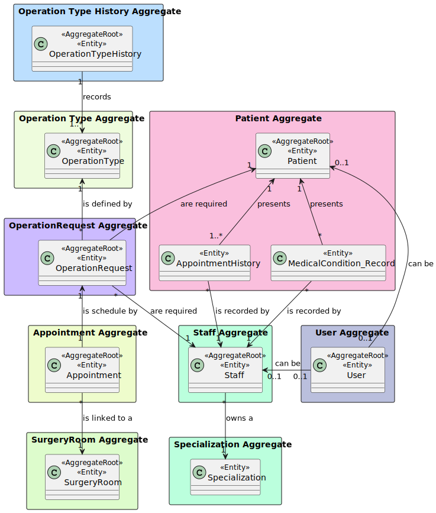
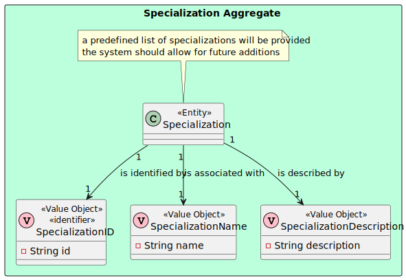

# US 5.1.12

## 1. Context

The context of this US is to update staff profiles, which represents the professionals providing healthcare (doctors and nurses), keeping audit logs of the changed data.

## 2. Requirements

### 2.1. User Story Description

- **US 5.1.13** As an Admin, I want to edit a staff’s profile, so that I can update their information.

### 2.2. Customer Specifications and Clarifications

> Question 1 - Availability slots
>
> Q: Na us 5.1.12, é referido que o admin apenas pode inserir o first name, last name, contact information e a specialization. No entanto, na us 5.1.13, é referido que o admin pode editar o contact information, availability slots e a specialization. O admin deveria só poder editar os parâmetros que ele próprio inseriu ou faz sentido poder editar o availability slots?
>
> A: considerem a edição dos availability slots como uma operação separada e fora do âmbito deste requisito.

### 2.3 Acceptance Criteria

1. Admins can search for and select a staff profile to edit.
2. Editable fields include contact information, availability slots, and specialization.
3. The system logs all profile changes, and any changes to contact information trigger a confirmation email to the staff member.
4. The edited data is updated in real-time across the system.

### 2.5. Dependencies/References

* N/A

### 2.6. Input and Output Data

***Input Data:***
* Typed data:
    * Email
    * Phone number
    * Specialization

***Output Data:***
* Success or insuccess

## 3. Analysis

### 3.1. Domain Model excerpt (DM)

## 4. Design

### 4.1. Realization

#### 4.1.1 Process view

##### 4.1.1.1 Level 1

##### 4.1.1.2  Level 2

##### 4.1.1.3  Level 3

#### 4.1.2 Logical view

##### 4.1.2.1 Level 1

##### 4.1.2.2  Level 2

##### 4.1.2.3  Level 3

#### 4.1.3 Cenário view

##### 4.1.3.1 Level 1

### 4.2. Padrões aplicados

Os padrões aplicados são:

- REST + ONION (padrões arquiteturais);
- DTO;
- Persistence;
- Controller;
- Service;
- Interfaces;
- Schema;
- Mapper;
- Repository;
- ORM.

### 4.3. Tests

**Domain Tests:**

* Domain tests are found in the class: Domain.Tests\StaffTest.cs

**E2E Tests:**

* E2E tests were performed in Postman.

**Integration Tests with isolation:** 

* Integration tests are found in the class: WebApi.IntegrationTest\Staff

## 6. Observations

N/A