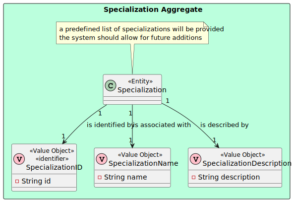

# US 6.2.11

## 1. Context

The context of this US to implement the user interface to edit staff profiles, which represents the professionals providing healthcare (doctors and nurses), keeping audit logs of the changed data. This user story belongs to the Backoffice Web Application module.

## 2. Requirements

### 2.1. User Story Description

- **US 6.2.11** As an Admin, I want to edit a staff’s profile, so that I can update their information.

### 2.2. Customer Specifications and Clarifications

> Question 1 - Availability slots
>
> Q: Na us 5.1.12, é referido que o admin apenas pode inserir o first name, last name, contact information e a specialization. No entanto, na us 5.1.13, é referido que o admin pode editar o contact information, availability slots e a specialization. O admin deveria só poder editar os parâmetros que ele próprio inseriu ou faz sentido poder editar o availability slots?
>
> A: considerem a edição dos availability slots como uma operação separada e fora do âmbito deste requisito.

> Question 2 - User interface
>
> Q: Gostaríamos de lhe perguntar se tem algum grupo de funções ou aparência que espera para as UIs das USs passadas ou se fica a cargo da equipa que desenvolve os aspetos estéticos da aplicação.
>
> A: A componente estética é de livre escolha da equipa. tentem seguir as boas práticas de aplicações web e usabilidade.

### 2.3 Acceptance Criteria

1. Admins can search for and select a staff profile to edit.
2. Editable fields include contact information, availability slots, and specialization.
3. The system logs all profile changes, and any changes to contact information trigger a confirmation email to the staff member.
4. The edited data is updated in real-time across the system.

### 2.5. Dependencies/References

* N/A

### 2.6. Input and Output Data

***Input Data:***
* Typed data:
    * Email
    * Phone number
    * Specialization

***Output Data:***
* Staff edited/updated

## 3. Analysis

### 3.1 Business Rules
* A staff must be unique in terms of `License Number`, `Email` and `Phone`.
* Staff define the availability slots, e.g. slot 1: 2024-09-25:14h00-18h00; slot2:
  2024-09-25:19h00/2024-09-26:02h00.
* The availability slots remain unchanged when slots are used for an
  appointment.
* Staff can handle multiple appointments but cannot be double-booked at the
  same time.

### 3.2. Domain Model excerpt (DM)

## 4. Design

### 4.1. Realization

#### The following diagrams were created:
* Logical View (Level 1, 2, 3 and 4)
* Physical View (Level 1, 2, 3 and 4)
* Implementation view (Level 1, 2, and 3)
* Scenario View (Level 1)
* Process View (Level 1, 2 and 3) - see UC update where X represents staff profile

**Note:** These diagrams are in *Docs/Sprint B/c4 models with views* folder

### 4.2. Tests

**Unit Tests:**

* Unit tests are found in *frontend-angular-app/src/app/pages/manage-staffs/update-staff/update-staff.component.spec.ts*

**E2E Tests:**

* E2E tests were performed in *frontend-angular-app/cypress/e2e/Staff/update-staff.cy.ts*

## 6. Observations

N/A