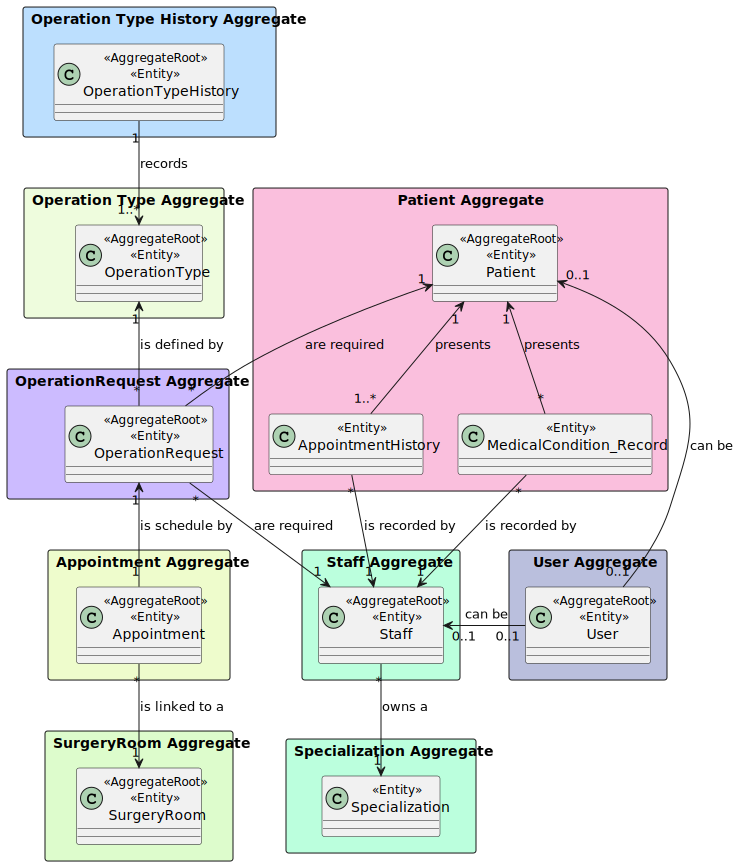

# US 6.2.12

## 1. Context

The context of this US to implement the user interface to deactivate staff profiles, which represents the professionals providing healthcare (doctors and nurses), but their historical data (e.g., appointments) remains accessible. This user story belongs to the Backoffice Web Application module.

## 2. Requirements

### 2.1. User Story Description

- **US 6.2.12** As an Admin, I want to deactivate a staff profile, so that I can remove them from the hospital’s active roster without losing their historical data.

### 2.2. Customer Specifications and Clarifications

> Question 1 - User interface
>
> Q: Gostaríamos de lhe perguntar se tem algum grupo de funções ou aparência que espera para as UIs das USs passadas ou se fica a cargo da equipa que desenvolve os aspetos estéticos da aplicação.
>
> A: A componente estética é de livre escolha da equipa. tentem seguir as boas práticas de aplicações web e usabilidade.

### 2.3 Acceptance Criteria

1. Admins can search for and select a staff profile to deactivate.
2. Deactivating a staff profile removes them from the active roster, but their historical data (e.g., appointments) remains accessible.
3. The system confirms deactivation and records the action for audit purposes.

### 2.5. Dependencies/References

* N/A

### 2.6. Input and Output Data

***Input Data:***
* Typed data:
    * Staff id

***Output Data:***
* Success or insuccess

## 3. Analysis

### 3.1 Business Rules
* A staff must be unique in terms of `License Number`, `Email` and `Phone`.
* Staff define the availability slots, e.g. slot 1: 2024-09-25:14h00-18h00; slot2:
  2024-09-25:19h00/2024-09-26:02h00.
* The availability slots remain unchanged when slots are used for an
  appointment.
* Staff can handle multiple appointments but cannot be double-booked at the
  same time.

### 3.2. Domain Model excerpt (DM)

## 4. Design

### 4.1. Realization

#### The following diagrams were created:
* Logical View (Level 1, 2, 3 and 4)
* Physical View (Level 1, 2, 3 and 4)
* Implementation view (Level 1, 2, and 3)
* Scenario View (Level 1)
* Process View (Level 1, 2 and 3) - see UC search where X represents staff profile

**Note:** These diagrams are in *Docs/Sprint B/c4 models with views* folder

### 4.2. Tests

**Unit Tests:**

* Unit tests are found in *frontend-angular-app/src/app/pages/manage-staffs/search-staff/search-staff.component.spec.ts*

**E2E Tests:**

* E2E tests were performed in *frontend-angular-app/cypress/e2e/Staff/search-staff.cy.ts*

## 6. Observations

N/A